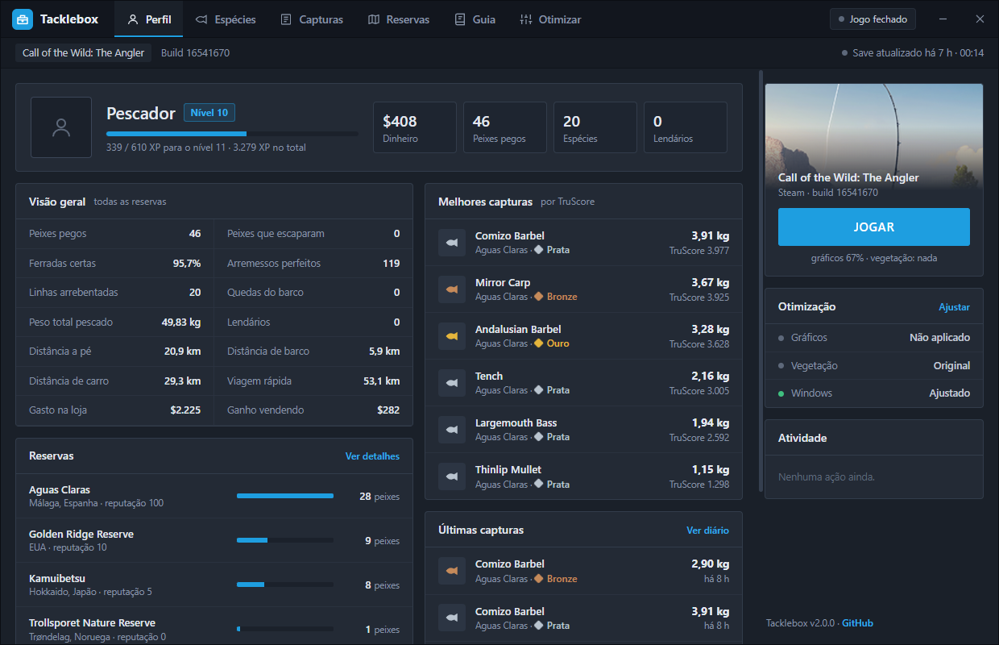
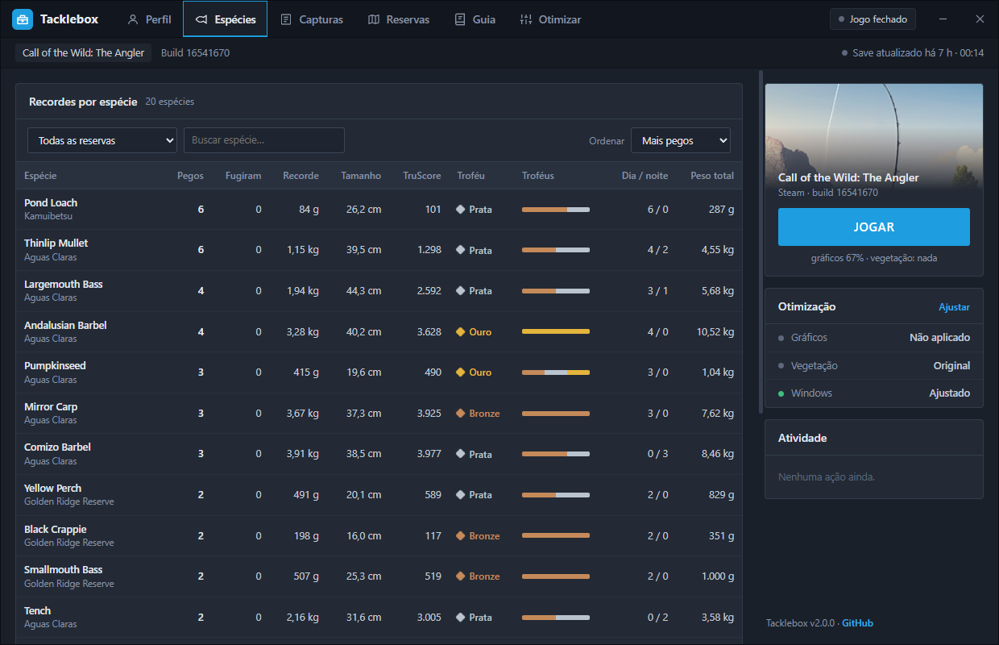
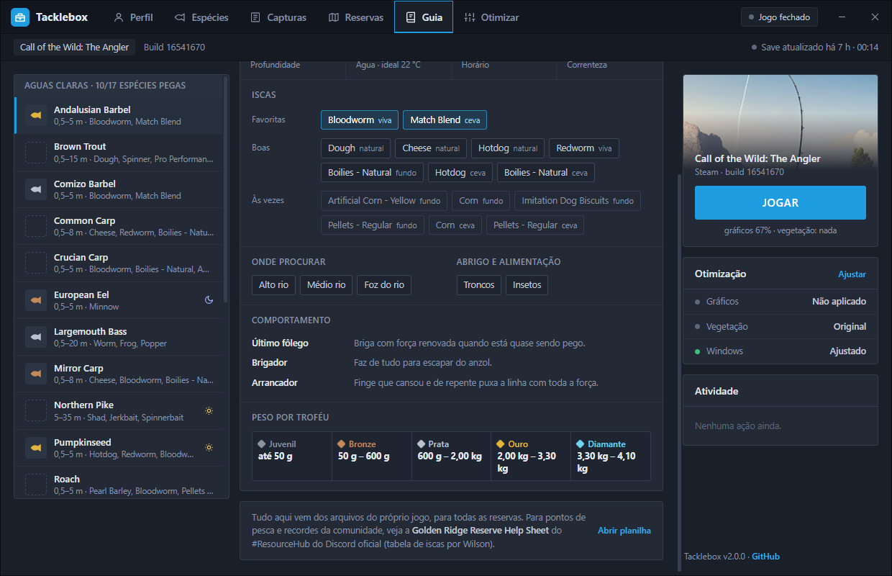
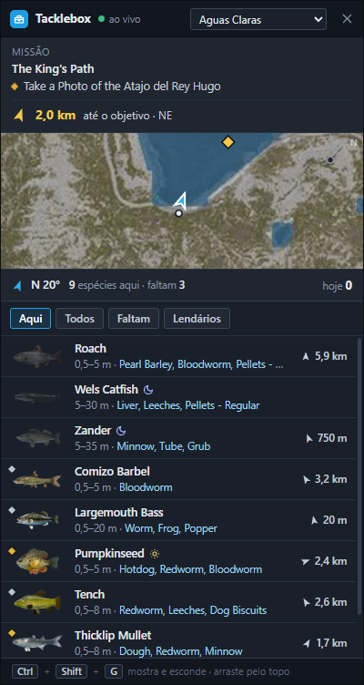
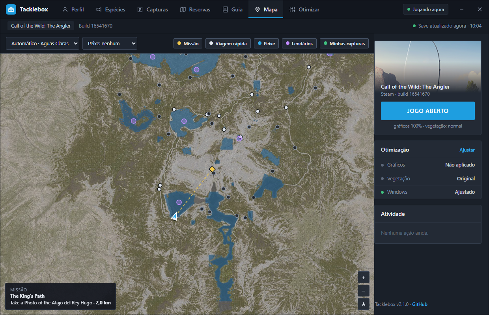
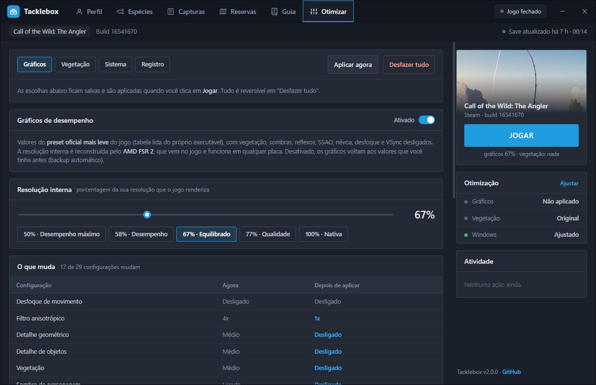

# Tacklebox

Launcher para **Call of the Wild: The Angler** (Steam): suas estatísticas lidas do save, um guia de pesca de todas as reservas com overlay por cima do jogo, e otimização com um clique (gráficos com AMD FSR 2, mapas sem vegetação e ajustes do Windows).



## Download

**[Baixar Tacklebox.exe](https://github.com/CristiancMartini/tacklebox/releases/latest/download/Tacklebox.exe)** · Windows 10/11 64 bits · um arquivo só, não precisa instalar.

> O executável não é assinado digitalmente, então o Windows pode mostrar "O Windows protegeu o computador". Clique em **Mais informações → Executar assim mesmo**. O código está todo aqui se quiser conferir ou compilar você mesmo.

## O que tem

### Estatísticas

Lidas do save do jogo no seu PC (só leitura) e atualizadas sozinhas enquanto você joga:

- **Perfil:** nível e XP, dinheiro, peixes pegos, espécies, lendários, ferradas certas, distâncias percorridas e mais.
- **Espécies:** recorde de peso, tamanho e TruScore de cada espécie, troféus por medalha e capturas de dia e de noite.
- **Capturas:** o diário com as últimas capturas de cada reserva.
- **Reservas:** reputação e números de cada mapa.



### Guia de pesca

Para cada peixe de cada reserva (Golden Ridge, Trollsporet, Aguas Claras, Izilo Zasendulo e Kamuibetsu, inclusive os lendários):

- **iscas** separadas em favoritas, boas e "às vezes";
- **iscas artificiais** e o tipo de recolhimento (contínuo, stop & go, twitching, jigging);
- profundidade, temperatura da água, correnteza e horário (diurno ou noturno);
- habitats, abrigo, alimentação e comportamento na briga;
- faixa de peso de cada troféu (bronze, prata, ouro, diamante).

Tudo vem das tabelas do próprio jogo, então cobre todas as reservas e acompanha as atualizações. A lista marca as espécies que você já pegou e filtra as que faltam.



### Overlay no jogo



Aperte **Ctrl+Shift+G** com o jogo aberto: aparece um painel na lateral da tela, que acompanha você ao vivo:

- **Missão atual** e o objetivo que está na tela do jogo, com **seta e distância até o objetivo** e, quando compensa, o ponto de viagem rápida já desbloqueado mais perto dele.
- **Minimapa** de uns 2 km ao seu redor: você, o objetivo e os pontos de viagem rápida.
- **Peixes aqui:** as espécies que vivem no lago ou rio onde você está (o jogo divide cada reserva em corpos d'água, cada um com a sua lista), com foto, iscas favoritas e quais você ainda não pegou.
- **Onde pegar:** seta e distância até os pontos que o próprio jogo marca para cada espécie (áreas das missões de pesca, com a faixa de troféu, desafios de local e esconderijos dos lendários) e até os lugares onde você já pegou aquele peixe.
- Direção para onde você está olhando e quantos peixes pegou hoje.

Clique num peixe para ver foto, iscas, artificiais, habitat e comportamento. O painel some sozinho quando você sai do jogo (alt-tab) e volta quando você volta; aperte o atalho de novo para desligar.

- Não injeta nada no jogo: é uma janela normal do Windows, sempre por cima, que não rouba o teclado nem o mouse do jogo.
- Posição, reserva e missão são lidas da memória do jogo em **modo somente leitura** (nada é alterado).
- Para ela aparecer por cima, use **Window Mode: Borderless** nas opções de vídeo do jogo (em tela cheia exclusiva o Windows não deixa nada ficar por cima).
- O Tacklebox precisa estar aberto (pode ficar minimizado).

<br clear="right">

### Mapa



O mapa de cada reserva, feito com a textura do terreno do próprio jogo (lagos e rios em azul), com zoom e arraste. Mostra você ao vivo, a linha até o objetivo da missão, os pontos de viagem rápida (desbloqueados e não), os pontos de cada peixe, as zonas dos lendários e onde você já pescou. No Guia, "ver no mapa" abre os pontos do peixe escolhido.

### Otimização



- **Gráficos:** aplica no `settings.ini` os valores do **preset oficial mais leve** (tabela lida do executável do jogo), com vegetação, sombras pesadas, reflexos, SSAO, névoa volumétrica, profundidade de campo e VSync desligados. A resolução interna (50% a 100%) é reconstruída pelo **AMD FSR 2**, que já vem no jogo e funciona em qualquer placa. A tela mostra cada configuração antes e depois; antes da primeira mudança é feito um backup.
- **Vegetação:** três modos, para todas as reservas, inclusive DLCs. O que some também perde a colisão, e os arquivos originais do jogo não são alterados.

  | Modo | O que some |
  |---|---|
  | Normal | nada |
  | Sem grama e mato | grama, flores, mato, arbustos, pedras soltas e plantas d'água (árvores ficam) |
  | Nada | tudo, inclusive árvores próximas e distantes |

- **Windows:** marca o jogo para usar a placa de vídeo dedicada (faz muita diferença em notebook), desliga a gravação em segundo plano do Xbox Game Bar e abre o jogo com prioridade acima do normal. Só no seu usuário, sem administrador.

As escolhas ficam salvas e são aplicadas quando você clica em **JOGAR**. **Desfazer tudo** volta tudo como era. Se o jogo estiver aberto, o Tacklebox espera ele fechar e continua sozinho.

Pela linha de comando:

```
Tacklebox.exe --auto       aplica as opções salvas e abre o jogo, sem interface
Tacklebox.exe --desfazer   volta tudo como estava
```

## Perguntas frequentes

**Dá ban?** O jogo não tem anti-cheat e o Tacklebox não injeta nada nem altera o jogo. As estatísticas e o guia leem arquivos; o overlay lê a posição, a reserva e a missão da memória do jogo, só leitura (o mesmo tipo de acesso de um gerenciador de tarefas); os gráficos usam o mesmo arquivo que o menu do jogo grava. A vegetação é uma modificação de arquivos (num pacote extra, sem tocar nos originais), então não dá pra garantir 100%; se preferir, use só os gráficos.

**Tem DLSS?** O jogo não tem DLSS. Colocar à força exigiria injetar DLL no jogo. O FSR 2 já vem no jogo e faz o mesmo papel.

**Resolve lag online?** Não. Melhora FPS e travadas; lag de internet depende da conexão e do host.

**O overlay não aparece.** Confira se o jogo está em **Borderless** e se o Tacklebox está aberto. Se outro programa já usa Ctrl+Shift+G, o aviso aparece na aba Otimizar → Registro, e o overlay abre pelo botão na aba Guia.

**O jogo atualizou e deu problema.** Clique em "Desfazer tudo" e depois aplique de novo: o pacote de vegetação é sempre gerado a partir dos arquivos da sua instalação.

## Créditos

Para pontos de pesca e recordes, vale ver a [Golden Ridge Reserve Help Sheet](https://docs.google.com/spreadsheets/d/1Es_hECA7EiUO1r1FiPxnmmxtoTMsFkX4cjK39zZH_Fc/edit), do #ResourceHub do Discord oficial do The Angler (tabela de iscas por Wilson). O Tacklebox não copia dados da planilha, só aponta para ela.

## Como funciona

Detalhes para quem quiser mexer (tudo descoberto analisando os arquivos do jogo, Apex Engine):

- **Arquivos do jogo:** `archives_win64\initial\gameN.tab/.arc` (TAB v3). Cada entrada é indexada pelo **MurmurHash3 x64_128 (h1)** do caminho; os dados são zlib, em blocos de 512 KB. O jogo carrega `game0`…`gameN` e, quando o mesmo arquivo aparece em mais de um pacote, vale o último.
- **Save e estatísticas:** `%USERPROFILE%\Saved Games\Avalanche Studios\CotWTheAngler\Saves\<steamid>\player_save_data` é um ADF (Avalanche Data Format), que descreve os próprios tipos; o leitor é genérico (`adf.go`). Espécies e reservas são identificadas pelo hash **lookup3** do Bob Jenkins do nome interno; os níveis vêm de `progression_curves.csvc`.
- **Guia:** `settings/game_data_tables/fish_codex_<reserva>.csvc` (habitat, profundidade, temperatura, comportamento, pesos), `fish_codex_bait_compatibility.csvc` (preferência de cada isca e recolhimento, de 5 a 40), `item_defs.csvc` e os textos de `text/master_eng.stringlookup`.
- **Mundo:** `worlds/<reserva>/.../global_trufish.blo` (RTPC) define os corpos d'água do sistema de peixes (TruFish), cada um com a lista de espécies (lookup3 do FishID). As missões de pesca têm áreas que forçam uma espécie e uma faixa de troféu (`TruFishOverrideArea`), e os lendários têm zonas próprias (`L_<espécie>_N`, as mesmas do códice).
- **Ao vivo:** o executável tem RTTI, então a vtable de `CPlayer`, `CMissionHUDModel` e `CReserveSelectModel` é localizada no .exe e os objetos são procurados na memória do jogo (somente leitura). Coordenadas: X para leste, Z para o sul.
- **Fotos:** `ui/shared/textures/items/<tamanho>/<peixe>.ddsc` (textura AVTX em BC3), convertidas em PNG.
- **Mapa:** `worlds/<reserva>/terrain/terrain_color_gpu_2048.ddsc` cobre os 16384 m do `WorldSize` (8 m por pixel, norte = -Z); lagos e rios vêm dos blocos de `global_water.blo`. Os ícones do mapa do jogo (classe de ícone nos `.blo` das localidades) trazem posição, tipo, nome de viagem rápida (o mesmo hash de `UnlockedFastTravelData` no save) e `mission_id`.
- **Missão:** cada `objective_id` dos arquivos de missão tem lookup3 igual ao ID do objetivo no save; o texto da tela leva à chave de texto, dela ao objetivo e à área onde ele acontece, ajustada pelo ícone da missão no mapa.
- **Gráficos:** `settings.ini`, seção `[Graphics]`. As faixas de cada opção e a tabela dos presets (Potato → Ultra) foram lidas do executável. A escala de resolução é `FrameScaleMinimum_V2` com `FrameScaleMode=2` (manual).
- **Vegetação:** `worlds/<mapa>/climate/vegetation_layers.vegetationinfo` (ADF). O **alcance de cada camada** (`VegetationModelLayer.Range` e as camadas de billboard e de física) é aplicado na hora de desenhar; o Tacklebox põe 1 m nas camadas escolhidas e `0xdeadbeef` ("nenhum") na física e nos efeitos dos objetos delas, e grava um pacote extra `game<N+1>`. Testado e descartado: a pasta `dropzone` (a função que a monta está vazia no jogo publicado) e montar pastas com `--vfs-fs/--vfs-archive` (o jogo fecha ao entrar no mapa).

O código está organizado em: `core.go` (ações), `ini.go` (gráficos), `vegmod.go` (vegetação e formato dos pacotes), `adf.go`/`stats.go` (save), `gamedata.go`/`guide.go`/`rtpc.go`/`places.go`/`texture.go` (tabelas, guia, lugares e fotos), `livegame.go` (dados ao vivo), `mission.go` (destino da missão), `map.go` (imagem do mapa), `mycatches.go` (onde você pegou), `winsys.go` (Windows), `gui.go`/`window.go`/`overlay.go` e `ui/` (interface em WebView2).

## Compilar

Requer Go 1.26+ no Windows.

```
go install github.com/tc-hib/go-winres@latest
go-winres make --arch amd64
go build -trimpath -ldflags "-H windowsgui" -o dist\Tacklebox.exe .
```

Ou rode `build.ps1`.

## Aviso

Projeto independente, sem relação com a Expansive Worlds ou a THQ Nordic. "Call of the Wild: The Angler" é marca dos seus donos. Use por sua conta e risco. Licença [MIT](LICENSE).
