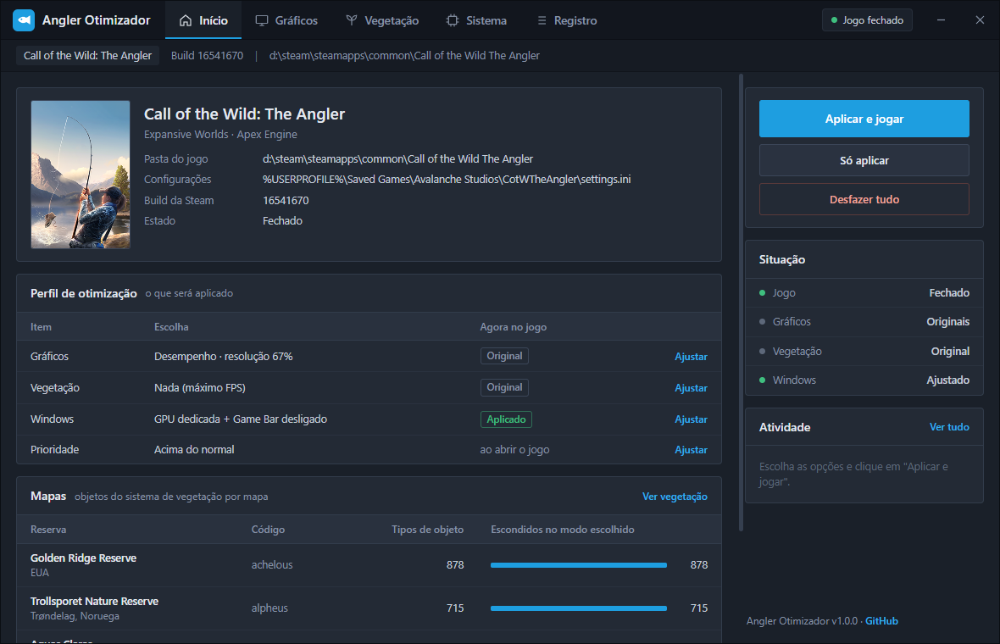
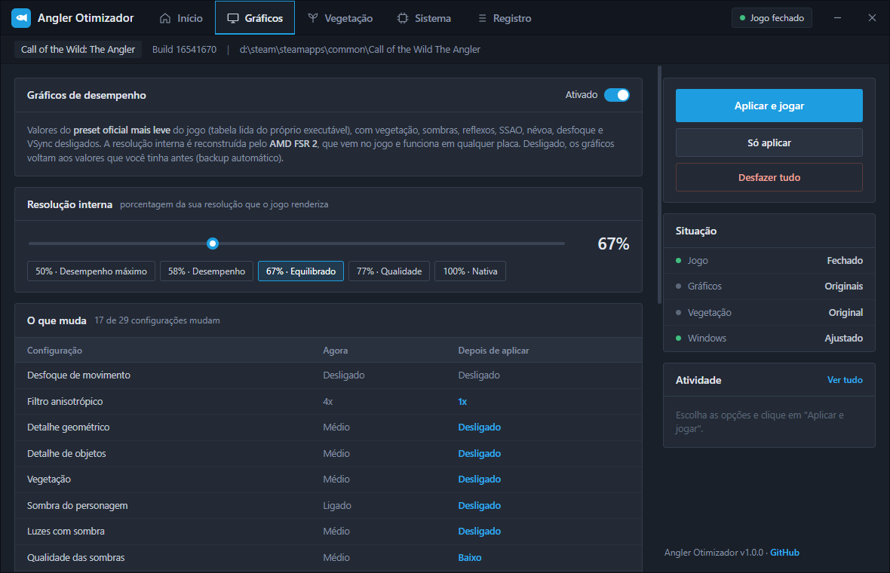
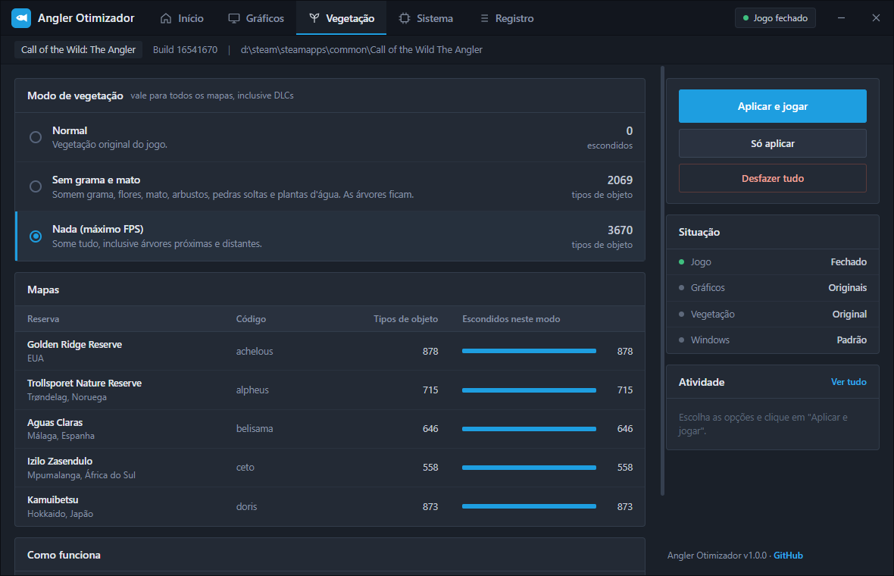
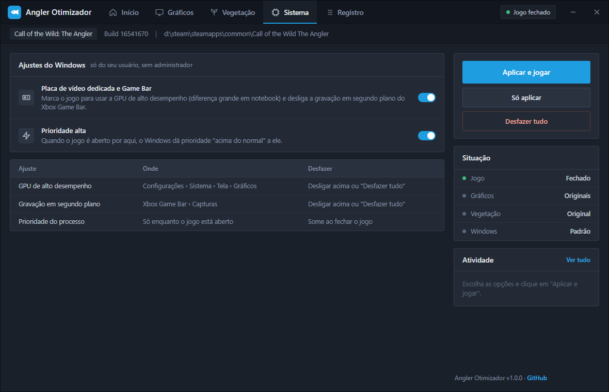

# Angler Otimizador

Deixa o **Call of the Wild: The Angler** (Steam) bem mais leve: gráficos de desempenho com AMD FSR 2, mapas sem grama, mato, pedras e árvores (todas as reservas, inclusive DLCs) e ajustes do Windows. Tudo com um clique e tudo reversível.



## Download

**[Baixar AnglerOtimizador.exe](https://github.com/CristiancMartini/angler-otimizador/releases/latest/download/AnglerOtimizador.exe)** · Windows 10/11 64 bits · um arquivo só, não precisa instalar.

> O executável não é assinado digitalmente, então o Windows pode mostrar "O Windows protegeu o computador". Clique em **Mais informações → Executar assim mesmo**. O código está todo aqui se quiser conferir ou compilar você mesmo.

## Como usar

1. Abra o `AnglerOtimizador.exe`.
2. Escolha as opções nas abas (ou só use o padrão).
3. Clique em **Aplicar e jogar**. Se o jogo estiver aberto, o programa espera você fechar e continua sozinho.
4. Para voltar tudo como era: **Desfazer tudo**.

As opções ficam salvas. Pela linha de comando:

```
AnglerOtimizador.exe --auto       aplica as opções salvas e abre o jogo, sem interface
AnglerOtimizador.exe --desfazer   volta tudo como estava
```

## O que ele faz

### Gráficos



Aplica no `settings.ini` do jogo os valores do **preset oficial mais leve** (a tabela de presets foi lida do próprio executável), com vegetação, sombras pesadas, reflexos, SSAO, névoa volumétrica, profundidade de campo e VSync desligados. A resolução interna (50% a 100%) é reconstruída pelo **AMD FSR 2**, que já vem no jogo e funciona em qualquer placa. A aba mostra cada configuração **antes e depois**. Antes da primeira mudança é feito um backup; desligando a opção, os gráficos voltam ao que você tinha.

### Vegetação



| Modo | O que some |
|---|---|
| Normal | nada |
| Sem grama e mato | grama, flores, mato, arbustos, pedras soltas e plantas d'água (árvores ficam) |
| Nada | tudo, inclusive árvores próximas e distantes |

Vale para Golden Ridge Reserve, Trollsporet (Noruega), Aguas Claras (Espanha), Izilo Zasendulo (África do Sul) e Kamuibetsu (Japão). O que some também perde a colisão, então não sobra obstáculo invisível. Os arquivos originais do jogo não são alterados.

### Sistema



- Marca o jogo para usar a **placa de vídeo dedicada** (faz muita diferença em notebook).
- Desliga a **gravação em segundo plano do Xbox Game Bar**.
- Abre o jogo com **prioridade acima do normal**.

Tudo só no seu usuário, sem pedir administrador, e desfeito pelo "Desfazer tudo".

## Perguntas frequentes

**Dá ban?** O jogo não tem anti-cheat, o programa não injeta nada no jogo e só muda o que aparece na sua tela. Os gráficos usam o mesmo arquivo que o menu do jogo grava. A vegetação é uma modificação de arquivos (num pacote extra, sem tocar nos originais), então não dá pra garantir 100%; se preferir, use só os gráficos.

**Tem DLSS?** O jogo não tem DLSS. Colocar à força exigiria injetar DLL no jogo. O FSR 2 já vem no jogo e faz o mesmo papel.

**Resolve lag online?** Não. Melhora FPS e travadas; lag de internet depende da conexão e do host.

**O jogo atualizou e deu problema.** Clique em "Desfazer tudo" e depois aplique de novo: o pacote de vegetação é sempre gerado a partir dos arquivos da sua instalação.

## Como funciona

Detalhes para quem quiser mexer (tudo descoberto analisando os arquivos do jogo, Apex Engine):

- **Configurações:** `%USERPROFILE%\Saved Games\Avalanche Studios\CotWTheAngler\settings.ini`, seção `[Graphics]`. As faixas de cada opção e a tabela dos presets (Potato → Ultra) foram lidas do executável. A escala de resolução é `FrameScaleMinimum_V2` com `FrameScaleMode=2` (manual).
- **Arquivos do jogo:** `archives_win64\initial\gameN.tab/.arc` (TAB v3). Cada entrada é indexada pelo **MurmurHash3 x64_128 (h1)** do caminho; os dados são zlib, em blocos de 512 KB.
- **Vegetação:** `worlds/<mapa>/climate/vegetation_layers.vegetationinfo` (ADF). Os objetos já vêm posicionados nos `streampatch` de cada mapa, mas o **alcance de cada camada** (`VegetationModelLayer.Range` e as camadas de billboard e de física) é aplicado na hora de desenhar. O otimizador põe 1 m nas camadas escolhidas e `0xdeadbeef` ("nenhum") na física e nos efeitos dos objetos delas. Nomes dentro dos ADF usam o hash **lookup3** do Bob Jenkins.
- **Como o arquivo alterado entra:** o jogo carrega `game0`…`gameN` enquanto existirem, e quando o mesmo arquivo aparece em mais de um pacote, vale o último. O otimizador grava um pacote extra `game<N+1>` com os arquivos alterados. Testado e descartado: a pasta `dropzone` (a função que a monta está vazia no jogo publicado) e montar pastas com `--vfs-fs/--vfs-archive` (o jogo fecha ao entrar no mapa).

O código está organizado em: `core.go` (ações), `ini.go` (gráficos), `vegmod.go` (vegetação e formato dos pacotes), `winsys.go` (Windows), `gui.go`/`window.go`/`ui/index.html` (interface em WebView2).

## Compilar

Requer Go 1.26+ no Windows.

```
go install github.com/tc-hib/go-winres@latest
go-winres make --arch amd64
go build -trimpath -ldflags "-H windowsgui" -o dist\AnglerOtimizador.exe .
```

Ou rode `build.ps1`.

## Aviso

Projeto independente, sem relação com a Expansive Worlds ou a THQ Nordic. "Call of the Wild: The Angler" é marca dos seus donos. Use por sua conta e risco. Licença [MIT](LICENSE).
